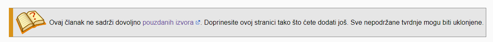
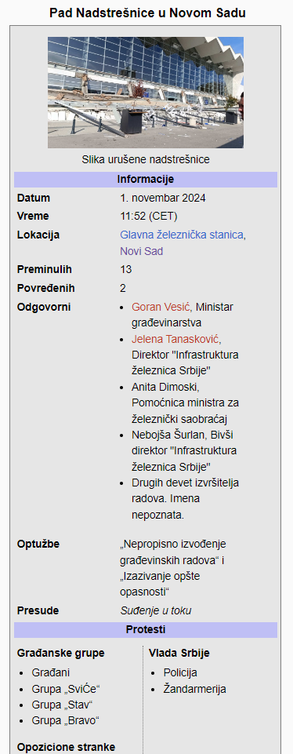

# Welcome to English SNSWiki!

**⚠️ All examples with images in this guide are in Serbian. Sorry!**
## Contents

1. [Editing guidelines](#pravila)
2. [How to contribute](#funkcija)
3. [This folder (`/en/`)](#folder)
4. [Editor use guide](#editor)
5. [Page folder structure](#struktura)
6. [Formatting](#formatiranje)

## Editing Guidelines<a name="pravila"></a>

- Use reliable sources, referencing government-leaning tabloids should be avoided.

- For discussing a specific tab use the "discussions" tab on GitHub, and for any other site-related suggestions use the "issues" tab.

- Stay civil, vandalism and botting aren't allowed.

- All large claims made need to be backed by a [source](#izvori).

- All images added to the `Images` folder need to be copyright free/free use. If you add any images covered by copyright you need explicit permission from the author.

## How to contribute<a name="funkcija"></a>

The <a href="https://sns.graphite.in.rs/">SNSWiki</a> site holds its data (pages) in this repository. To create a page you need to make a folder [here](#folder), which has the same name as the page. The structure of that folder is defined [below](#struktura).

#### How to create a new page

I imagined the use of this page to go like this:

- Write an article in the [on-site editor](#editor).
- Once you finish you just copy the test to the GitHub editor and publish changes.

But then i realized that most people likely don't have experience with GitHub's UI and such.

#### 1. GitHub account

Unfortunately you do need a GitHub account to make changes to repositories, and by extension SNSWiki.

#### 2. Creating a new page

First you need to go to the `/en/` folder (this one) and you will see an "add files" button.


If you press "Create new file" or "Upload files", and you haven't edited on SNSWiki earlier, a prompt will show up:


This just means that you will have to create a copy of the wiki on your own GitHub account, you can just click the green button and you will go on to the next step,


On this page you're filling out the file name, its path and its contents. In the upper, smaller, textbox, you should to put in the **name of the folder**, and then the name of the file. For example, if you're creating a page called "Example" you would type in `Example/example.html`.

In the lower, bigger, textbox is for the article itself.

By clicking on the "commit changes" button you're saving all changes and moving on to the fourth step.


Here you will get the comparation of the current state of that page and your changes (if the page didnt exist before it will just be empty).


This is the final step. Here you are leaving a message related to your changes.  When you click the green button your changes will be sent for review.

Once you go through this process once you will be able to edit or create any page without going through this entire process again.

#### Editing already existing files

Once you open a file in GitHub, there will be a small pen icon in the top right corner, pressing that button will allow you to edit that file.

## This  folder (`/en/`)<a name="folder"></a>

### `en-meta.json` file 

This file contains general metadata for the english side of the site. Aside the pages array, which shouldn't be manually modified, there is also the `featured` array which contains the articles featured in the sidebar of the site.

### `placeholder.html` file

This file is the article that's loaded when someone tries to go to a page that doesn't exist yet. Links that lead to non-existent pages are red.

## Page folder structure <a name="struktura"></a>

The page folder should contain a `.html` file with the same name (but lowercase), which contains the article itself. The folder could also include an `Images` folder which contains all images used in the article.

It could also contain a `.json` file with the same name as the folder (but lowercase), which contains all the metadata for that page. For now that metadata is in the following format:

```
{
    "link": "",
    "keywords": [],
    "description": "",
    "image": ""
}
```

The `link` property is the name of the article in Serbian, this connects the two sides of the wiki.
The `keywords` array contains the SEO keywords.
`description` represents a short description of the article, and `image` is an image in the `Images` folder that represents the article.

Everything in this structure is **case-sensitive**, `Images` starts with an uppercase I, the `.json` and `.html` files are always lowercase. The name of the folder is the title of the page that shows up on the site, and as such the capitalization should be adequate.

#### Example of a page folder:

```
📂 2020 Covid Protests
┣ 📂 Images
┃  ┣ 🖼️ Protest_ispred_skupstine.png
┃  ┣ 🖼️ Policija_bije_gradjane.png
┃  ┗ 🖼️ Protest_2.png
┣ 📄 2020 covid protests.html
┗ 📄 2020 covid protests.json
```

In this case `2020 covid protests.html` would be the article that would show up on the site under the title "2020 Covid Protests". The `link` field in the `.json` file would be the article name in serbian.

In essence, the only thing a page needs to function is the folder itself and the `.html` file.
## Editor use guide<a name="editor"></a>

Because the files on this site are created and edited on GitHub, and GitHub doesn't have the capability to preview articles, the site includes a "on-site editor", on which you can edit and save your article drafts.

The editor has a few useful tools, and can do anything a regular text editor can (undo, redo, etc.).

It can save **at most ten drafts at a time** and each one needs to have a different name.

**The "delete draft" button doesn't have a confirmation prompt, once you click the little garbage can, your draft is permanently deleted**

The preview button will close the text editor and, well, preview the article you typed out.

Unfortunately the editor cannot access any files in `Images` folder.

## Formatting

The markup language this wiki uses is, like everything else, custom made by me. It is actually just fancy HTML and uses custom tags for elements and formatting. All custom tags include the prefix `w`.

For everyone unfamiliar with HTML, here's a crash course:

- Almost all tags that open need to close, using that same tag with the `/` character: `<tag></tag>`
- HTML ignores newlines and more than one space (If you were to type `"abcdef      ghi"`, only "abdcef ghi" would show up)

Some basic tags are:
- `<p></p>`, text inside these tags counts as a paragraph, and as such is spaced out away from the text surrounding it. All blocks of text should be paragraphs.
- `<b></b>`, is **bold**.
- `<i></i>`, is *italic*.
- `<br>` doesn't have a closing tag and creates a new line.
- `<ul></ul> and <ol></ol>` form lists, they're a bit more complicated though, you can learn more about them [here](https://www.w3schools.com/html/html_lists.asp).

### Basic formatting

Basic formatting like *italic*, **bold** and such are done through vanilla HTML. A good reference for HTML is [W3Schools](https://www.w3schools.com/tags/).

You could use HTML for literally anything in articles, but that's a bit more advanced and isn't covered in this guide.

### Headings  

Headings are denoted with tags `<w-h1>` through `<w-h3>`, where 1 is the largest and 3 is the smallest heading. They're used by just inserting the heading text between the tags.

#### Example:

`<w-h1>This is the largest heading</w-h1>`

### Images

Images are inserted into articles by using the `<w-img>` tag. It's used by inserting the caption below the image and then, seperated with `|`, the URL to the image. The caption text is optional.

In case the image you want to use is in the `Images` folder of your page, you can simply use the file name instead of the URL.

#### Examples:

Without a caption:

`<w-img>https://example.com/</w-img>`

With a caption:

`<w-img>This is some image|https://example.com/</w-img>`

Image from the `Images` folder:

`<w-img>This is some image|example.png</w-img>`

### Hyperlinks

Hyperlinks are added to the article using the `<w-a>` tag, it can be used for both internal and external links. The text that shows up instead of the URL should be seperated with the `|` character.

External links that lead to Wikipedia are counted as internal and don't have the icon that external links usually do.

#### Examples:

External: `<w-a>example of external link|https://example.com/</w-a>`


Internal: `<w-a>example of internal link|Aleksandar Vučić</w-a>`

### References <a name="izvori"></a>

Inline references are inserted with the `<w-ref>` tag. All sources can have a name, and using that name you can re-use them. **For the list of references at the bottom of the page to show up, you need to add a `<w-reflist>` tag at the end of the article**.

Good sources are: Books, news articles, information from some official site, short video clips, etc.

A source should (if possible) include:

- First and last name of author

- Year of publishing

- Name of the source (Article title, title of video, etc.)

- URL to the source

- You should make it clear if the source is gotten from an archive.

#### Examples:

`<w-ref name="stanica"><i><w-a>Ko je radio rekonstrukciju zgrade Železničke stanice u Novom Sadu|https://n1info.rs/biznis/ko-je-radio-rekonstrukciju-zgrade-zeleznicke-stanice-u-novom-sadu/</w-a></i>, 1. Novembar 2024. N1 Beograd</w-ref>`

If we want to use this same source with the same number again, we would just type:

`<w-ref name="stanica"></w-ref>`

The `name` attribute is **NOT** required, it's just used to avoid typing the same thing again.

The code above would have the following results:


At the end of the page we would insert `<w-reflist></w-reflist>` for the list of all sources used in the article, which would look like this:


To change the title of this section (In this case it's "Izvori", the serbian for "Sources"), we need to change the "title" attribute, for example `<w-reflist title="References"></w-reflist>`.

### Annotations

Annotations represent stylized text aligned to the middle of the page. They're used for some information for the reader or other editors.

Oni se ubacuju u stranicu sa `<w-annotation>` tagom i imaju tri vrste: `none`, `warn` i `danger`. Ove vrste se određuju `type` atributom, a "default" je `none`.

They're inserted with `<w-annotation>` tag and have three types: `none`, `warn` and `danger`. These types are assigned with the `type` attribute, and the default is `none`.

`none` is a regular *italic* paragraph aligned to the middle of the page. It usually represents some sort of extra info for the reader, like for example if there's a similar article with the same name.

`warn` has a yellow border and notifies other editors about some important but not necessarily urgent issues with the article. On Wikipedia it's used to mark an article that's outdated or doesn't have adequate sources.

`danger` has a red border and notifies other editors about urgent issues with the article. On Wikipedia it's used for pages that are due for deletion.

Annotations can have the `image` attribute which is a link to an image used to the right of the annotation text. This is purely for aesthetics and is not mandatory. 

#### Examples:

`<w-annotation> Ovo je članak o Covid protestima 2020. godine, za ekološke proteste sličnog imena, pogledajte <w-a>Ekološki protesti 2020</w-a> </w-annotation>`

`<w-annotation type="warn" image="https://upload.wikimedia.org/wikipedia/en/thumb/9/99/Question_book-new.svg/512px-Question_book-new.svg.png?20210726203442">Ovaj članak ne sadrži dovoljno <w-a>pouzdanih izvora|https://github.com/Graphite2213/SNSWiki-Pages/tree/master/rs#izvori</w-a>. Doprinesite ovoj stranici tako što ćete dodati još. Sve nepodržane tvrdnje mogu biti uklonjene.</w-annotation>
`

The code above would result in the following:




### Infoboxes

Infobox is an element which contains some general information about the page which it's on. Wikipedia example:


On SNSWiki, you would add an infobox like this:

```
<w-infobox title="2020 COVID Protests">
[Infobox elements]
</w-infobox>
```

**Infobox elements**, which use the prefix `wi-`, are as follows:

- `<wi-section>` is the section title in an infobox. The default background color is blue.

- `<wi-image>` is a full-sized image in an infobox. It's used exactly like other [image](#slike) tags.

- `<wi-row>` represents a row in an infobox, it has two values, left and right. The left and right values are seperated with the `|` character. Both left and right values can be links and lists. However if you wish to add an image to the left or right fields, you need to use `<wic-image>` which is used like other image tags but can't have a caption.

- `<wi-vs>` is an element used for representing two opposed sides.

    It needs to include at least 2 `<wvs-side>` elements, which represent the sides. Those sides need to include at least one `<wvs-p>` which represents the parties on each side.

    Those parties can be text, links or lists. If the party is a list, the `<wvs-p>` element can include the `list` and `collapsed` attributes. The `list` attribute is the title of the list, and the `collapsed` attribute determines if the list is collapsable.

#### Example:

Here's a complete infobox example:

```
<w-infobox title="Pad Nadstrešnice u Novom Sadu">
    <wi-image>Slika urušene nadstrešnice|https://www.alo.rs/data/images/2024-11-01/969788_img-20241101-wa0013_f.jpg</wi-image>
    <wi-header>Informacije</wi-header>
    <wi-row>Datum|1. novembar 2024</wi-row>
    <wi-row>Vreme|11:52 (CET)</wi-row>
    <wi-row>Lokacija|<w-a>Glavna železnička stanica|https://sr.wikipedia.org/wiki/Железничка_станица_Нови_Сад</w-a>, <w-a>Novi Sad|https://sr.wikipedia.org/wiki/Нови_Сад</w-a></wi-row>
    <wi-row>Preminulih|13</wi-row>
    <wi-row>Povređenih|2</wi-row>
    <wi-row>Odgovorni|<ul>
        <li><w-a>Goran Vesić</w-a>, Ministar građevinarstva</li>
        <li><w-a>Jelena Tanasković</w-a>, Direktor "Infrastruktura železnica Srbije"</li>
        <li>Anita Dimoski, Pomoćnica ministra za železnički saobraćaj</li>
        <li>Nebojša Šurlan, Bivši direktor "Infrastruktura železnica Srbije"</li>
        <li>Drugih devet izvršitelja radova. Imena nepoznata.</li>
    </ul></wi-row>
    <wi-row>Optužbe|„Nepropisno izvođenje građevinskih radova“ i „Izazivanje opšte opasnosti“</wi-row>
    <wi-row>Presude|<i>Suđenje u toku</i></wi-row>
    <wi-header>Protesti</wi-header>
    <wi-vs>
        <wvs-side>
            <wvs-p list="Građanske grupe">
                <ul>
                    <li>Građani</li>
                    <li>Grupa „SviĆe“</li>
                    <li>Grupa „Stav“</li>
                    <li>Grupa „Bravo“</li>
                </ul>
            </wvs-p>
            <wvs-p list="Opozicione stranke">
                <ul>
                    <li>Zeleno-levi Front</li>
                    <li>Demokratska Stranka</li>
                </ul>
            </wvs-p>
        </wvs-side>
        
        <wvs-side>
            <wvs-p list="Vlada Srbije">
                <ul>
                    <li>Policija</li>
                    <li>Žandarmerija</li>
                </ul>
            </wvs-p>
        </wvs-side>
    </wi-vs>
</w-infobox>
```

This code gives the following result:


