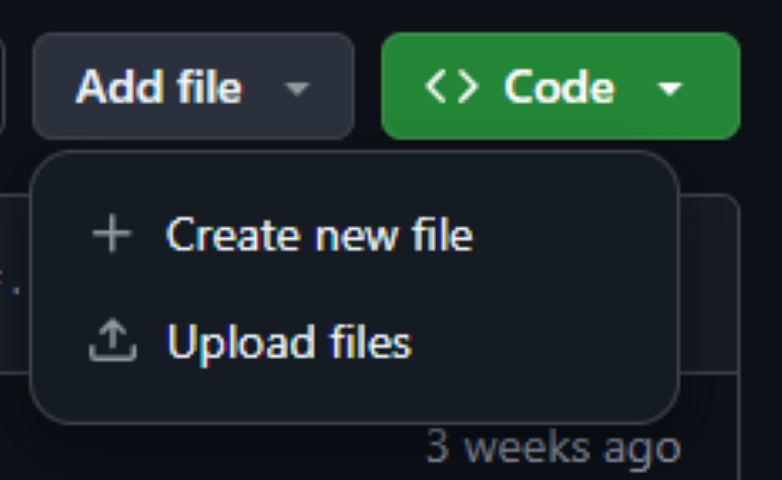
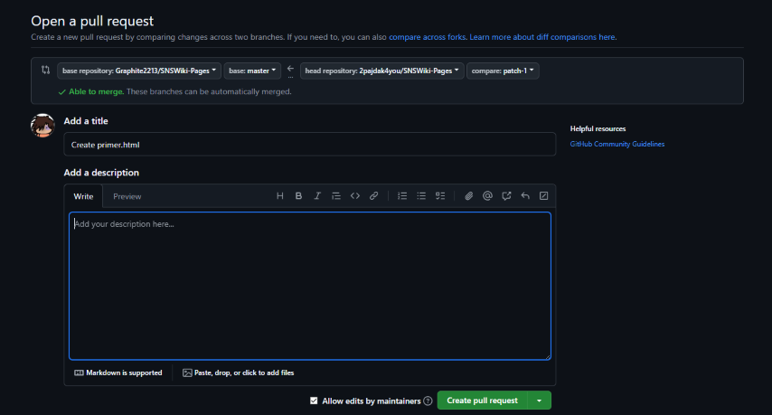

# Dobrodošli na Srpski SNSWiki!

Neću dužiti sa nekim mojim govorom o tome kako i zašto sam napravio ovo, za to pogledajte glavnu stranicu same SNSWikije. Ovaj README je većinom o tome kako zapravo urediti nešto na wikiji.

## Sadržaj

1. [Kako sajt funkcioniše](#funkcija)
2. [Pravila uređivanja](#pravila)
3. [Ovaj folder `/rs/`](#folder)
4. [Uputstvo za korišćenje editora](#editor)
5. [Struktura stranice](#struktura)
6. [Formatiranje / Sintaksa](#formatiranje)

## Kako sajt funkcioniše / Kako doprineti <a name="funkcija"></a>

Sajt <a href="https://sns.graphite.in.rs/">SNSWiki</a> vuče podatke (stranice) odavde. Jedna stranica je zapravo samo folder. Da bi stvorili stranicu morate stvoriti taj folder, a ime foldera je ujedno i naslov stranice. 

### Struktura foldera

Folder stranice treba da sadrži `.html` fajl sa istim imenom (ali malim slovima), koji je sav tekst i elementi koji se nalaze na stranici. Folder može imati i `Images` folder koji sadrži sve slike koje ta stranica koristi.

Taj folder takođe može sadržati `.json` fajl sa istim imenom (ali malim slovima) koji u sebi sadrži metapodatke za tu stranicu. Zasad su ti metapodaci u sledećem formatu:

```
{
    link: "",
    keywords: []
}
```

Ovde je `link` ime te stranice na drugom jeziku (ako ste na srpskoj wikiji, onda je to ime stranice na engleskoj strani sajta). To povezuje dve strane wikije.
`keywords` niz sadrži ključne reči za SEO, u osnovi, to su reči po kojima Google i ostali pretraživači pamte tu stranicu.

Sve u ovoj strukturi je **case-sensitive**, `Images` počinje velikim slovom, `.json` i `.html` fajlovi su uvek sve malim slovima. Samo ime foldera je naslov stranice koji se prikazuje na sajtu pa velika i mala slova trebaju da budu adekvatna.

#### Primer strukture jedne stranice:

```
📂 Covid Protesti 2020
┣ 📂 Images
┃  ┣ 🖼️ Protest_ispred_skupstine.png
┃  ┣ 🖼️ Policija_bije_gradjane.png
┃  ┗ 🖼️ Protest_2.png
┣ 📄 covid protesti 2020.html
┗ 📄 covid protesti 2020.json
```

Ovde bi `covid protesti 2020.html` bila stranica koja se pojavljuje na sajtu pod imenom "Covid Protesti 2020", a u `link` polju u `.json` fajlu bi pisalo ime te stranice na engleskoj strani wikije.

U suštini, jedino što je potrebno da sajt funkcioniše je sam folder i `.html` fajl unutar njega.


### Kako zapravo napraviti novu stranicu

Kako sam ja zamislio da se koristi ovaj sajt je:

- Napišete članak u [editoru](#editor), da bi mogli uživo da pratite šta radite
- Kad završite ovde pravite novi fajl (na dugme "add file") i samo prebacite tekst iz wiki editora u GitHub editor.

Ali sam shvatio da većina ljudi koja verovatno želi da uredi nešto nije upoznata sa GitHub interfejsom i ne zna kako se dodaju fajlovi, folderi i slično.

##### 1. GitHub nalog

Nažalost GitHub zahteva da imate nalog da bi ste pravili izmene na repozitorijumima. To znači da morate napraviti GitHub nalog da bi doprineli SNSWiki.

##### 2. Kreacija nove stranice (u praksi)

Prvo trebate da odete u `rs` folder, onda će vam se prikazati dugme za dodavanje fajla.



Ako ovde kliknete na "Create new file" ili "Upload files", a niste ranije pravili stranice, izaćiće vam sledeća poruka:


Ovo u osnovi znači da morate da napravite kopiju SNSWikije na svom nalogu, odavde trebate samo da kliknete zeleno dugme i prećićete na sledeći korak,


Ovde unosite ime fajla i njegov sadržaj. U gornjem textbox-u morate da unesete **naziv foldera**, i onda da upišete naziv fajla. Na primer, za članak s imenom "Primer", u gornji textbox bi ste napisali `Primer/primer.html`. Tako se kreira i folder i fajl za stranicu koju pravite. Ja sam to već uradio u ovoj slici.

U donjem, velikom textbox-u, se unosi članak koji ste predhodno napisali.

Pritiskanjem zelenog dugmeta "commit changes" čuvate izmene i prelazite na četvrti korak.


Ovde će vam izaći poređenje između trenutnog stanja SNSWikije i vaših izmena. Možete samo kliknuti zeleno dugme i nastaviti dalje.



Ovo je poslednji korak. Ovde unosite poruku koju imate za izmene. Klikom na zeleno dugme vaše izmene se šalju na pregled.

Pošto jednom prođete ove korake moćićete da menjate/stvarate bilo koju stranicu bez da prolazite kroz sve ovo ponovo.

### Uređivanje već postojećih članaka

Ukoliko fajl već postoji, kad ga locirate i otvorite u GitHub-u pojaviće se mala ikonica olovke. Kad nju kliknete moćićete da menjate taj fajl.

## Generalna pravila uređivanja <a name="pravila"></a>

- Držite se pouzdanih izvora, tabloide koji su privržni vlasti treba ređe koristiti.

- Za diskusiju oko neke specifične stranice koristite "discussions" tab, a ako želite da predložite nešto u vezi samog sajta (formatiranje, layout) koristite "issues" tab.

- Ostanite civilizovani, botovanje i vandalizam nisu dozvoljeni.

- Svaka velika tvrdnja na stranici mora biti podržana sa odgovarajućim [izvorom](#izvori).

## Ovaj folder `/rs/` <a name="folder"></a>

### `rs-meta.json` fajl 

Ovaj fajl sadrži generalne meta-podatke za srpsku stranu sajta. Osim stranica (`pages` niz koji **ne treba dirati ručno**) koje sam repozitorijum prati i dodaje, takođe postoji i `featured` koji sadrži stranice koje se nalaze u "sidebar"-u sajta.

### `placeholder.html` fajl

Ovaj fajl predstavlja članak koji je učitan kad na wikiji pratite link koji nema stranicu još uvek. Takvi linkovi su na sajtu crveni.

## Uputstvo za korišćenje editora<a name="editor"></a>

Pošto se stranice na ovom sajtu kreiraju i uređuju ovde, na GitHub-u, a GitHub nema opciju za preview toga što ste napisali, na sajtu se nalazi "on-site editor" u kom možete kucati i čuvati vaše nedovršene članke.

Editor ima par korisnih alatki, i sve opcije običnog text editora (undo, redo, itd.).

On može da čuva **maksimalno deset "draft"-ova** i svaki mora imati **različito ime**. 

**Dugme za brisanje drafta nema prompt da potvrdite brisanje, jednom kad kliknete malu kantu za smeće, draft je trajno obrisan.**

Preview dugme će zatvoriti text editor i pokazati vam kako bi vaša stranica izgledala da je uživo na sajtu.

Nažalost editor nema pristup slikama u `Images` folderu.

## Formatiranje

Jezik koji koristi ovaj wiki je, kao i sve ostalo, napravljen namenski od strane mene. On je zapravo samo našminkani HTML i koristi tagove za sve elemente i formatiranje. Svi custom tagovi imaju prefiks `w`.

Za sve koji nisu upoznati sa HTML-om, evo ga jedan "crash course":

- Skoro svaki tag koji se otvori mora i da se zatvori koristeći taj isti tag sa `/` karakterom: `<tag></tag>`
- HTML ignoriše nove linije i više od jednog razmaka (Kad bi napisali "<pre>abcdef      ghi</pre>", samo bi se pojavilo "abcdef ghi").

Neki osnovni tagovi su:

- `<p></p>`, tekst unutar ovog taga se računa kao paragraf i odvojen je od ostatka teksta sa praznim linijama. Sve celine u tekstu bi trebale da budu paragrafi.
- `<b></b>`, je **bold**.
- `<i></i>`, je *italic*.
- `<br>` nema svoj zatvarajući tag i predstavlja praynu liniju u tekstu.
- `<ul></ul> i <ol></ol>` su liste, one su malo komplikovanije i možete naći više informacija o njima [ovde](https://www.w3schools.com/html/html_lists.asp).

### Osnovno formatiranje

Osnovno formatiranje kao što su *italic*, **bold** i slično se vrši kroz obični HTML. Dobra referenca za HTML je [W3Schools](https://www.w3schools.com/tags/).

Po potrebi moguće je koristiti HTML za bukvalno bilo šta na stranicama, ali to je malo naprednije i nije pokriveno ovim uputstvom.

### Naslovi  

Naslovi se označavaju sa tagovima `<w-h1>` do `<w-h3>`, gde je 1 najveći a 3 najmanji "header" tag. Koriste se tako što ubacujete tekst koji treba da bude naslov među tagove.

#### Primer:

`<w-h1>Ovo je najveći naslov</w-h1>`

### Slike

Slike se u stranicu ubacuju kroz `<w-img>` tag. Koristi se tako što u tag ubacite URL slike koju želite da prikažete. Opciono možete dodati tekst ispod slike tako što ćete ga ubaciti pored teksta, odvojeno s karakterom `|`.

U slučaju da se slika koju želite da iskoristite nalazi u `Images` folderu vaše stranice, možete samo navesti ime fajla te slike umesto URL-a.

#### Primeri:

Bez teksta:

`<w-img>https://example.com/</w-img>`

Sa tekstom:

`<w-img>Ovo je neka slika|https://example.com/</w-img>`

Slika u `Images` folderu:

`<w-img>Ovo je neka slika|example.png</w-img>`

### Linkovi

Linkovi se u stranice dodaju kroz `<w-a>` tag, on može da se koristi i za unutrašnje linkove (prema ostatku wikije) ili za spoljašnje linkove (koji vode ka drugim sajtovima). Tekst koji se pojavljuje umesto samog linka treba odvojiti s karakterom `|`.

Spoljašni linkovi koji vode ka wikipediji se vode kao unutrašnji, i nemaju ikonicu koju spoljašnji linkovi nose.

#### Primeri:

Spoljašnji: `<w-a>primer spoljašnjeg linka|https://example.com/</w-a>`

  
Unutrašnji: `<w-a>primer unutrašnjeg linka|Aleksandar Vučić</w-a>`

### Izvori <a name="izvori"></a>

Takozvani "inline" izvori se na ovoj wikiji dodaju sa tagom `<w-ref>`. Svaki izvor može imati ime, i tako se može iskoristiti opet. **Obavezno je dodati `<w-reflist>` tag na kraju stranice da bi se stvorio odvojen deo sa svim izvorima.**
  
Dobri izvori su: Knjige, novinski članci, informacije s nekog zvaničnog sajta, kratki isečci iz videa itd.

Izvor (po mogućnosti) treba da sadrži:

- Ime i prezime autora

- Godinu objavljivanja

- Ime materijala (naslov članka, naslov videa, ime knjige)

- URL do materijala

- Naglasiti ako je materijal preuzet iz arhiva (npr. Internet Archive/Wayback Machine)

#### Primer:

`<w-ref name="izbori 2012"><w-a>https://www.vreme.com/projekat/izbori-2012-rezultati-i-postizborna-trgovina/|"Izbori 2012: Rezultati i postizborna trgovina"</w-a>. <i>Vreme</i>. 10. Maj 2012. Arhivirano 30. Juna 2022.</w-ref>`

Ako bi hteli opet da stavimo isti ovaj izvor sa istim brojem u jednom članku, samo bi napisali:

`<w-ref name="izbori 2012"></w-ref>`

`name` atribut **NIJE** obavezan, samo se koristi za ponovno korišćenje istog izvora.

Formatiranje iznad bi imalo ovakve rezultate:


Na kraju stranice stavljamo `<w-reflist></w-reflist>` za listu svih izvora navedenih u tekstu, što izgleda ovako:


Da bi promenili naslov "Izvori" možemo staviti atribut "title" da bude novi naslov, na primer `<w-reflist title="Reference"></w-reflist>`

### Anotacije

Anotacije (en. annotations) predstavljaju stilizovani tekst koji je "aligned" na sredini stranice. Koriste se za neke napomene, dodatne informacije ili upozorenja vezana za stranicu.

Oni se ubacuju u stranicu sa `<w-annotation>` tagom i imaju tri vrste: `none`, `warn` i `danger`. Ove vrste se određuju `type` atributom, a "default" je none.

`none` je običan *italic* tekst na sredini stranice. Inače obeležava neke dodatne informacije za čitaoca, kao na primer ako postoji drugi članak sa sličnim imenom.

`warn` ima žutu marginu i obaveštava o nekim važnim ali ne i nužno hitnim stvarima. Na Wikipediji on bi se koristio da se označi kad je neki članak "outdated" ili ako nema dovoljno izvora.

`danger` ima crvenu marginu i obaveštava o stvarima koje hitno moraju da se promene na stranici. Na Wikipediji on bi se koristio da obavesti druge urednike da je članak neadekvatan za sajt i da ga treba obrisati.

#### Primer:

`<w-annotation> Ovo je članak o Covid protestima 2020. godine, za ekološke proteste sličnog imena, pogledajte <w-a>Ekološki protesti 2020</w-a></w-annotation>`

`<w-annotation type="warn">Ovaj članak nema dovoljno izvora. Treba dodati još.</w-annotation>`

Formatiranje iznad bi napravilo ovakve anotacije: 


### Infoboksevi

Infoboks (en. infobox) je element koji sadrži neke generalne informacije o stranici na kojoj se nalazi. Evo primera sa wikipedije:


Na mom sajtu se infoboksevi dodaju u sledećoj formi:

```
<w-infobox title="COVID Protesti 2020">
[Infoboks elementi]
</w-infobox>
```

**Infoboks elementi**, koji imaju prefiks `wi-`, su sledeći:

- `<wi-section>` je naslov odeljka u infoboksu. Koristi se isto kao tagovi za naslov samo što nema više veličina. Default boja pozadine naslova je plava.

- `<wi-image>` je puna slika u infoboksu. Koristi se kao obični tag za [slike](#slike).

- `<wi-row>` koji predstavlja obični red u infoboksu sa levom i desnom vrednošću. Leva i desna strana su odvojene karakterom `|`. I leva i desna strana mogu da sadrže linkove i liste. Nasuprot, da bi stavili SLIKU na levu ili desnu stranu morate koristiti element `<wic-image>`. Koristi se isto kao drugi elementi za slike ali ne može da ima tekst ispod.

- `<wi-vs>` je element koji služi za prikazivanje dve suprotstavljene strane.

    On u sebi mora da sadrži bar 2 `<wvs-side>` dela, koji predstavljaju suprotstavljene strane, i te strane moraju sadržati svoje partije koje su predstavljene `<wvs-p>` elementom.

    Same partije mogu biti običan tekst, linkovi ili liste. Ako je partija lista u `<wvs-p>` element je moguće staviti dva opciona atributa, `list` i `collapsed`, gde `list` označava boldovani naslov liste, a `collapsed` označava da li je ta lista "kolapsovana" (sakrivena).

#### Primer:

Ovo je jedan kompletan infoboks, tekst je na engleskom jer je preuzet sa Wikipedija stranice za proteste "Srbije Protiv Nasilja":

```
<w-infobox title="2023 Serbian protests">
    <wi-image>protest.jpg|Demonstrators on 19 May 2023</wi-image>
                    
    <wi-header>Info</wi-header>
    <wi-row>Date|8 May – 4 November 2023</wi-row>
    <wi-row>Location|Serbia</wi-row>
    <wi-row>Caused by|<ul>
      <li>A school shooting and a mass murder on 3 and 4 May</li>
    </ul></wi-row>
    <wi-row>Goals|<ul>
      <li>Resignation of Branko Ružić, Bratislav Gašić and Aleksandar Vulin</li>
      <li>Resignations of the body members of the Regulatory Body for Electronic Media and Radio Television of Serbia</li>
      <li>Withdrawal of the national broadcasting licences of RTV Pink and Happy TV</li>
    </ul></wi-row>
    <wi-row>Methods|Demonstrations • civil roadblocks • civil resistance</wi-row>
    <wi-row>Concessions|<ul>
      <li>Resignation of education minister Branko Ružić</li>
    </ul></wi-row>
    <wi-header>Parties</wi-header>
    <wi-vs>
        <wvs-side>
            <wvs-p list="Anti-government protesters">
                <ul>
                    <li>Citizens</li>
                    <li>Farmers (16-20 May)</li>
                </ul>
            </wvs-p>
            <wvs-p list="Opposition parties" collapsed="true">
                <ul>
                    <li>Do not let Belgrade drown/Green–Left Front</li>
                    <li>Democratic Party</li>
                    <li>People's Party</li>
                    <li>Party of Freedom and Justice</li>
                    <li>Movement of Free Citizens</li>
                    <li>Together</li>
                </ul>
            </wvs-p>
        </wvs-side>
        
        <wvs-side>
            <wvs-p list="Government of Serbia">
                <ul>
                    <li>Police</li>
                </ul>
            </wvs-p>
            <wvs-p list="Government Parties">
                <ul>
                    <li>Serbian Progressive Party</li>
                    <li>Socialist Party of Serbia</li>
                </ul>
            </wvs-p>
        </wvs-side>
    </wi-vs>
    <wi-header>Lead Figures</wi-header>
    <wi-vs>
        <wvs-side>
            <wvs-p><i>No centralised leadership</i></wvs-p>
        </wvs-side>

        <wvs-side>
            <wvs-p>Aleksandar Vučić</wvs-p>
            <wvs-p>Ana Brnabić</wvs-p>
            <wvs-p>Aleksandar Vulin</wvs-p>
            <wvs-p>Bratislav Gašić</wvs-p>
        </wvs-side>
    </wi-vs>
</w-infobox>
```

Ovaj kod nam daje sledeći infobox:


