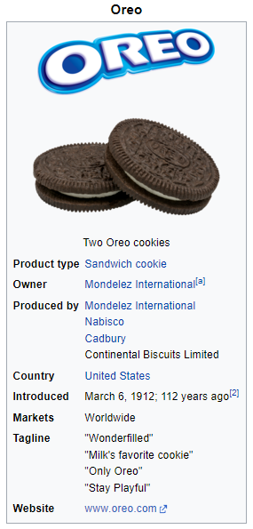

# Srpski SNSWiki

## Kako sajt funkcioniše / Kako doprineti

Sam <a href="https://sns.graphite.in.rs/">sajt SNSWiki</a> (koji se ne nalazi na ovom repozitorijumu) vuče podatke (stranice) odavde. Da bi stvorili stranicu morate da napravite folder koji odgovara stranici koju pokušavate da napravite, ime foldera je ujedno i naslov stranice. Ime fajla ne sme sadržati specijalne karaktere.
Taj folder treba da sadrži `.html` fajl sa istim imenom i `images` folder koji sadrži sve slike koje ta stranica koristi.

## Generalna pravila uređivanja

- Držite se pouzdanih izvora, tabloide koji su privržni vlasti treba ređe koristiti.
- Za diskusiju oko neke specifične stranice koristite "discussions" tab, a ako želite da predložite nešto u vezi samog sajta (formatiranje, layout) koristite "issues" tab. 
- Ostanite civilizovani, botovanje i vandalizam nisu dozvoljeni.
- Ton svih stranica sme da bude malo sarkastičan ali mora ostati objektivan.
- Svaka velika tvrdnja na stranici mora biti podržana sa odgovarajućim <a href="#izvori">izvorom.</a>

## `rs-meta.json` fajl

Ovaj fajl sadrži generalne metapodatke za srpsku stranu sajta. Osim stranica (`pages` niz koji **ne treba dirati manuelno**) koje sam repozitorijum prati i dodaje, takođe postoji i `featured` koji sadrži stranice koje se nalaze u "sidebar"-u sajta.

## Formatiranje
Jezik koji koristi ova wikija je, kao i sve ostalo, napravljena "custom" od strane mene. Ona je zapravo samo našminkani HTML i koristi tagove za sve elemente i formatiranje. Svi custom tagovi imaju prefiks `w`.

### Naslovi

Naslovi se označavaju sa tagovima `<w-h1>` do `<w-h3>`, gde je 1 najveći a 3 najmanji "header" tag. Koriste se tako što ubacujete tekst koji treba da bude naslov među tagove.

#### Primer:

`<w-h1>Ovo je najveći naslov</w-h1>`

### Slike

Slike se u stranicu insertuju kroz `<w-image>` tag. Koristi se tako što u tag ubacite URL slike koju želite da prikažete. Opciono možete dodati tekst ispod slike tako što ćete ga ubaciti pored teksta, odvojeno s karakterom `|`.

#### Primeri:

Bez teksta:
`<w-image>https://example.com/</w-image>`

Sa tekstom: 
`<w-image>https://example.com/|Ovo je neka slika</w-image>`

### Linkovi

Linkovi se u stranice dodaju kroz `<w-a>` tag, on može da se koristi i za unutrašnje linkove (Prema ostatku wikije) ili za spoljašnje linkove (Koji vode ka drugim sajtovima). Tekst koji se pojavljuje umesto samog linka treba odvojiti s karakterom `|`.

#### Primeri:

Spoljašnji: `<w-a>https://example.com/|primer spoljašnjeg linka</w-a>`

Unutrašnji: `<w-a>Aleksandar Vucic|primer unutrašnjeg linka</w-a>`

### Izvori

Takozvani "inline" izvori se na ovoj wikiji dodaju sa tagom `<w-ref>`. Svaki izvor može imati ime, i tako se može iskoristiti opet. <b>Obavezno je dodati `<w-reflist>` tag na kraju stranice da bi se stvorio odvojen deo sa svim izvorima.</b>

Dobri izvori su: Knjige, novinski članci, informacije s nekog zvaničnog sajta, kratki isečci iz videa itd. 

Izvor (po mogućnosti) treba da sadrži:

- Ime i prezime autora
- Godinu objavljivanja
- Ime materijala (naslov članka, naslov videa, ime knjige)
- URL do materijala
- Naglasiti ako je materijal preuzet iz arhiva (npr. Internet Archive/Wayback Machine)

Primer:
`

### Infoboksovi

Infoboks (en. infobox) je element koji sadrzi neke generalne informacije o stranici na kojoj se nalazi. Evo primera sa wikipedije:



Na mom sajtu se infoboksovi dodaju u sledećoj formi:
```
<w-infobox type="person" title="Aleksandar Šapić">
<wi-image>sap.jpg|Aleksandar "Gangula" Šapić</wi-image>
                
<wi-header>Lične Informacije</wi-header>
<wi-row>Pozicija|Gradonačelnik</wi-row>
<wi-row>Poslovi|Vaterpolista, Političar</wi-row>
<wi-row>Potpis|<wic-image>signature.png</wic-image></wi-row>
</w-infobox>
```

